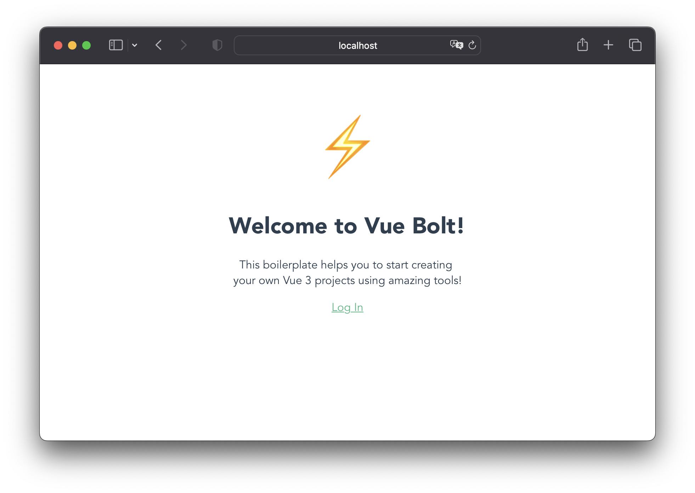

# ⚡️ Vite Tuto

 
   

This boilerplate helps you to start creating your own Vue 3 projects using ⚡️Vite, 🍍Pinia, 🚏Vuex Router, 📡 Axios, 🤹🏻‍♂️ Jest and more amazing tools.

Tuto is the short of Tutorial and the best/easier way to start creating a SPA using the latest versions of the best frameworks out there! 🤩

## 👨🏻‍🏫  Basic topics

- [What is Vue?](https://vuejs.org/guide/introduction.html#what-is-vue)
- [Single-File Components](https://vuejs.org/guide/introduction.html#single-file-components)
- [Reactivity Fundamentals](https://vuejs.org/guide/essentials/reactivity-fundamentals.html#reactivity-fundamentals)
- [Computed Properties](https://vuejs.org/guide/essentials/computed.html#computed-properties)
- [Props Declaration](https://vuejs.org/guide/components/props.html#props-declaration)
- [Slots](https://vuejs.org/guide/components/slots.html#slots)
- [Performance Overview](https://vuejs.org/guide/best-practices/performance.html#overview)
- [Pinia - What is a Store?](https://pinia.vuejs.org/getting-started.html#what-is-a-store)
- [Pinia - State](https://pinia.vuejs.org/core-concepts/state.html#state)
- [Pinia - Getters](https://pinia.vuejs.org/core-concepts/getters.html#getters)
- [Pinia - Actions](https://pinia.vuejs.org/core-concepts/actions.html)
- [Vuex Router - Getting Started](https://router.vuejs.org/guide/#getting-started)
- [Vuex Router - Navigation Guard](https://router.vuejs.org/guide/advanced/navigation-guards.html#navigation-guards)
- [Jest Unit Tests (🇪🇸)](https://medium.com/@agustinmorelle01/las-7-claves-del-%C3%A9xito-tests-unitarios-de-frontend-vue-js-y-jest-28988ae561ac)

## 💎 Features

- Basic login/logout state definition using Pinia.
- Basic Store configured using Pinia and Persist Plugin (stores/index.js).
- Basic "Home" and "Login" pages defined (src/pages/).
- Basic "Title" and "Button" components defined using slots and custom properties. 
- Basic router configuration defined (/router.js).
- Basic GET request using Axios (Spotify Tracker API). This request needs an [Authorization Bearer Token ](https://developer.spotify.com/console/get-users-currently-playing-track/). For security purposes you can just set this token on environment files.
- Environment file example.
- Jest configuration defined.
- Unit test suite per each defined page, API test included 😎.
- Path alias defined (vite.config.js).
- GitHub actions workflow example defined.

## 🏁 Start
Create your project directly from GitHub based
on tuto boilerplate right now:

## 🏃🏼‍♂️ Run

1. `npm install`
2. `npm run dev`

## 🧪 Run tests

1. `npm run test`
